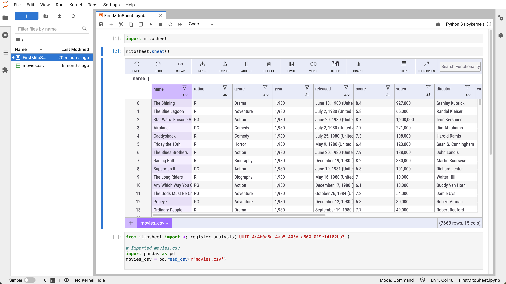

# mito_quickstart
Use this configuration to quickly spin up an instance of [Mito](https://www.trymito.io) and Jupyter on a Docker container.



## Prerequisites

* Docker

## Installation

```
docker-compose up
```

## Execution

This demo runs on an instance of [Jupyter Notebook](https://jupyter.org). To access the notebook, look for the URL on the console that launched the Docker environment. It should appear as something like this:

```
jupyter       |     To access the notebook, open this file in a browser:
jupyter       |         file:///home/jovyan/.local/share/jupyter/runtime/nbserver-16-open.html
jupyter       |     Or copy and paste one of these URLs:
jupyter       |         http://0b90cc578f8a:8888/?token=e04fb77ae092f52dd1a31bdc24d03f79933d0db1f620e77c
jupyter       |      or http://127.0.0.1:8888/?token=e04fb77ae092f52dd1a31bdc24d03f79933d0db1f620e77c
```

Launch the URL from a browser and navigate to the `FirstMitoSheet.ipynb` file.

Select the "IMPORT" button in the Mito Sheet and import the movies.csv file.

*NOTE: The movies.csv file came from [Movie Industry dataset on Kaggle](https://www.kaggle.com/danielgrijalvas/movies)*